# A3 End-to-End Workflow Map

Last updated: 2026-05-11

Printable app version: `/workflow-map`

```mermaid
flowchart LR
  A["Backup database and Storage"] --> B["Create users and roles"]
  B --> C["Import supplier companies"]
  C --> D["Import existing workers"]
  D --> E["Upload current documents"]
  E --> F["Enter opening balances"]
  F --> G["Upload or build monthly timesheets"]
  G --> H["Resolve reconciliation conflicts"]
  H --> I["Generate payroll"]
  I --> J["Operations approval"]
  J --> K["Management approval and lock"]
  K --> L["Generate payslips and packs"]
  L --> M["Record delivery"]
  M --> N["Audit log and retention"]
```

## What Gets Created

- Suppliers and supplier rates.
- Workers with permanent worker numbers.
- Document rows and private Storage files.
- Timesheet headers and lines.
- Payroll batches and payroll lines.
- Delivery log rows for payslips, warnings, letters, and packs.
- Audit log rows for database changes.
- Deleted-record snapshots for restore review.

## Approval Points

- Supplier company accepted for subcontract workers.
- Timesheet conflicts resolved.
- Operations approves hours.
- Management approves and locks payroll.
- Management approves destructive cleanup or restore decisions.
- HR/accounts records payslip and warning delivery.

## Data Locations

- Live data: Supabase Postgres.
- Uploaded files: Supabase Storage.
- Website: Vercel.
- Local backup exports: `backups/`.
- Import templates: `import-templates/`.
