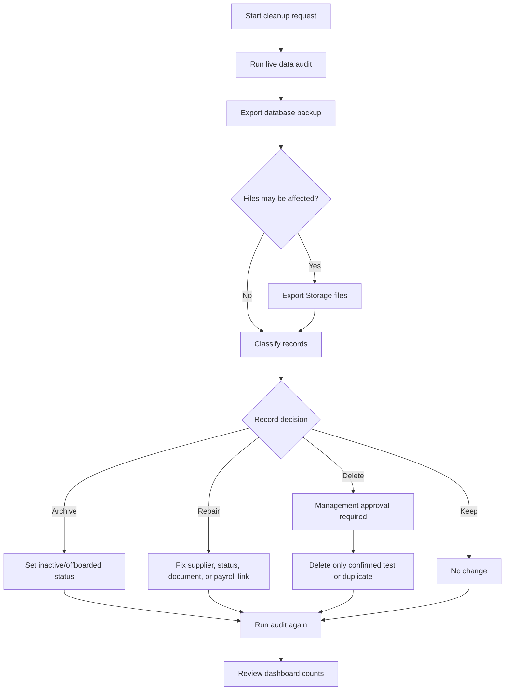

# Live Data Cleanup Plan

Last updated: 2026-05-11

This file explains why records still appear in the live dashboard and how to remove or repair them safely.

## Current Situation

The dashboard is showing live Supabase data. The visible worker count is not a mock front-end number.

Latest audit snapshot after full operational reset:

- Workers: 0.
- Suppliers: 0.
- Documents: 0.
- Timesheet headers: 0.
- Payroll batches: 0.
- Offboarding records: 0.
- Clients: 0.
- Storage files in worker/doc/letter/payroll buckets: 0.
- Likely demo/test workers: 0.
- Subcontract workers missing supplier: 0.
- Subcontract workers assigned to inactive or placeholder supplier: 0.
- Placeholder/demo suppliers: 0.

## Why Records Were Not Deleted Automatically

The records look like operational data and may include real people. Deleting them silently could remove payroll, document, warning, or offboarding history.

The safe decision is to classify records first:

- Keep: real employee or worker.
- Archive: old leaver or historical person.
- Repair: real person with wrong supplier/status/document.
- Delete: confirmed test or duplicate record only.

## Required Approval Before Cleanup

Get management approval before:

- Deleting workers.
- Deleting suppliers.
- Deleting documents or uploaded files.
- Removing payroll batches.
- Removing timesheets.
- Resetting operational tables.

## Safe Cleanup Steps

1. Run:

```powershell
npm run data:audit
```

2. Run:

```powershell
node scripts/exportOperationalBackup.mjs
```

3. If files might be removed, run:

```powershell
node scripts/exportOperationalBackup.mjs --storage-files
```

4. Export the worker list for review.
5. Mark each worker as keep, archive, repair, or delete.
6. Reassign the two subcontract workers currently attached to the placeholder supplier.
7. Confirm no rows still reference the placeholder supplier.
8. Archive or delete the placeholder supplier.
9. Re-run the audit.
10. Review the dashboard counts.

## Current Repair Item

Two subcontract workers were linked to an inactive or placeholder supplier:

- IWS-2026-0003 Joseph Mathew.
- IWS-2026-0007 Ahmed Al Rashidi.

On 2026-05-11 they were first reassigned away from the placeholder supplier, then the unused placeholder supplier was removed. After the user approved the full cleanup, all operational rows and related Storage objects were cleared after a full database and Storage backup.

## Recommended Approval Map


